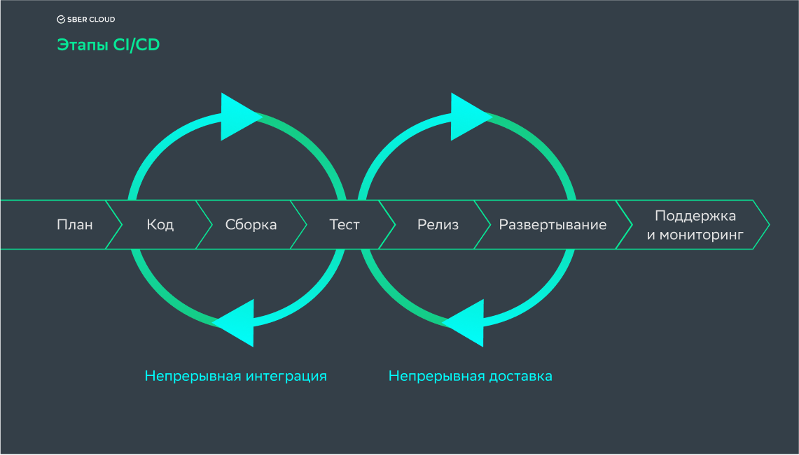

# CI/CD



## CI/CD на примере GithubActions
 
[Github Actions для этого репозитория](https://github.com/SciProgCentre/green-courses/actions)

```{literalinclude} github_actions.yaml
```

## Материалы для чтения

* [Что такое CI/CD? Разбираемся с непрерывной интеграцией и непрерывной поставкой](https://habr.com/ru/companies/otus/articles/515078/)
* [CI/CD](https://blog.skillfactory.ru/glossary/ci-cd/)